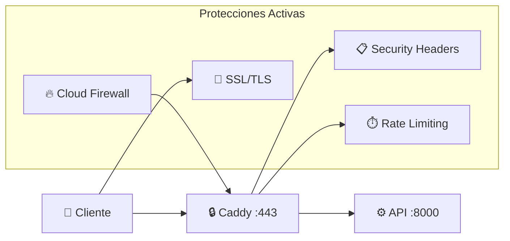

# 🔐 Autenticación y Autorización

## Modelo de Seguridad Actual

!!! info "Configuración Actual"
    El sistema actualmente **NO** requiere autenticación para acceder a la API, ya que está diseñado para uso interno y está protegido por:
    
    - **🔒 Proxy reverso**: Solo accesible a través de Caddy
    - **🛡️ Firewall**: Puerto 8000 no expuesto directamente
    - **🌐 Red privada**: API solo accesible desde la red Docker interna

## 🔄 Implementación Futura

### Opciones de Autenticación

=== "API Key Authentication"
    ```python
    # Implementación con header API Key
    from fastapi import Header, HTTPException
    
    async def verify_api_key(x_api_key: str = Header()):
        if x_api_key != VALID_API_KEY:
            raise HTTPException(status_code=401, detail="Invalid API key")
        return x_api_key
    ```
    
    ```bash
    # Uso con curl
    curl -H "X-API-Key: your-secret-key" \
         https://alertasfail2ban.xmakuno.com/api/jails
    ```

=== "JWT Token Authentication"
    ```python
    # Implementación con JWT
    from fastapi import Depends, HTTPException
    from fastapi.security import HTTPBearer
    
    security = HTTPBearer()
    
    async def verify_token(token: str = Depends(security)):
        try:
            payload = jwt.decode(token, SECRET_KEY, algorithms=["HS256"])
            return payload
        except jwt.InvalidTokenError:
            raise HTTPException(status_code=401, detail="Invalid token")
    ```
    
    ```bash
    # Uso con JWT
    curl -H "Authorization: Bearer your-jwt-token" \
         https://alertasfail2ban.xmakuno.com/api/jails
    ```

=== "Basic Authentication"
    ```python
    # Implementación básica
    from fastapi import Depends, HTTPException
    from fastapi.security import HTTPBasic, HTTPBasicCredentials
    
    security = HTTPBasic()
    
    async def verify_credentials(credentials: HTTPBasicCredentials = Depends(security)):
        if credentials.username != USERNAME or credentials.password != PASSWORD:
            raise HTTPException(status_code=401, detail="Invalid credentials")
        return credentials.username
    ```

## 🔒 Seguridad de Red Actual

### Capas de Protección



### Configuración de Seguridad

```caddyfile
# Configuración actual en Caddy
alertasfail2ban.xmakuno.com {
    reverse_proxy localhost:8000
    
    # Rate limiting por IP
    rate_limit {
        zone dynamic {
            key {remote_host}
            events 60
            window 1m
        }
    }
    
    # Security headers
    header {
        Strict-Transport-Security "max-age=31536000"
        X-Frame-Options "DENY"
        X-Content-Type-Options "nosniff"
    }
}
```

## 🛡️ Mejores Prácticas

### Para Uso Actual

```bash
# Verificar que el puerto 8000 NO esté expuesto
nmap -p 8000 tu_servidor_ip

# Solo debe ser accesible vía HTTPS
curl https://alertasfail2ban.xmakuno.com/health
```

### Para Implementación Futura

```python
# Ejemplo de middleware de seguridad
from fastapi import Request
from starlette.middleware.base import BaseHTTPMiddleware

class SecurityMiddleware(BaseHTTPMiddleware):
    async def dispatch(self, request: Request, call_next):
        # Rate limiting
        # IP whitelisting
        # Request validation
        response = await call_next(request)
        return response
```

## 📊 Monitoreo de Acceso

### Logs de Acceso

```bash
# Monitorear accesos a la API
sudo tail -f /var/log/caddy/access.log | grep "/api/"

# Verificar intentos no autorizados
grep "401\|403" /var/log/caddy/access.log
```

### Métricas de Seguridad

```python
# Implementar logging de seguridad
import logging

security_logger = logging.getLogger("security")

@app.middleware("http")
async def log_requests(request: Request, call_next):
    start_time = time.time()
    response = await call_next(request)
    process_time = time.time() - start_time
    
    security_logger.info(
        f"IP: {request.client.host} "
        f"Method: {request.method} "
        f"Path: {request.url.path} "
        f"Status: {response.status_code} "
        f"Time: {process_time:.4f}s"
    )
    return response
```

!!! warning "Estado Actual"
    El sistema actual **NO requiere autenticación** pero está protegido por múltiples capas de seguridad de red y proxy reverso.

!!! tip "Recomendación Futura"
    Para entornos de producción con múltiples usuarios, considera implementar autenticación basada en API keys o JWT tokens.

!!! success "Acceso Seguro"
    Accede siempre a través de: [https://alertasfail2ban.xmakuno.com](https://alertasfail2ban.xmakuno.com)