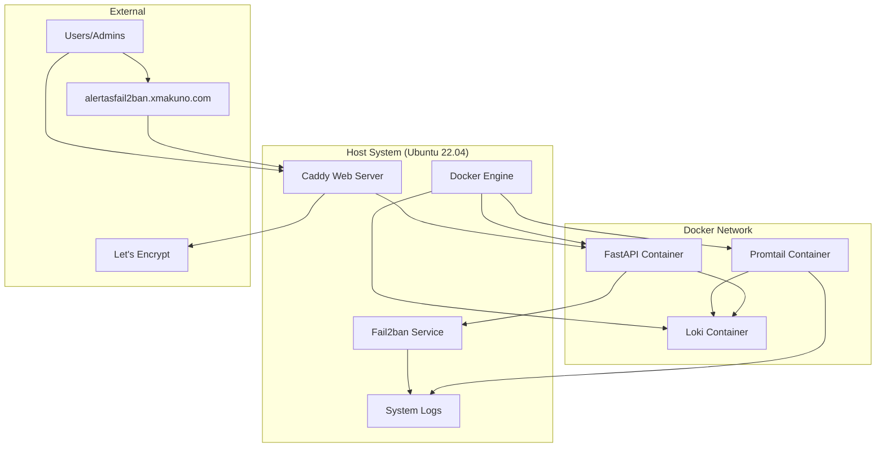

# 🗺️ Descripción General del Sistema

## Introducción

El sistema de monitoreo Fail2ban está diseñado como una **arquitectura de microservicios containerizada** que proporciona una solución completa para la gestión y monitoreo de seguridad en servidores.

## Componentes Principales



## Arquitectura de Alto Nivel

### 🏗️ Distribución de Servicios

El sistema está distribuido en **dos capas principales**:

=== "Host Level"
    Servicios que se ejecutan directamente en el sistema operativo Ubuntu:
    
    - **🛡️ Fail2ban**: Monitoreo y baneos automáticos
    - **🔒 Caddy**: Servidor web y proxy inverso con SSL automático
    - **🐳 Docker Engine**: Plataforma de containerización
    - **📂 Sistema de archivos**: Logs y configuraciones

=== "Container Level"
    Servicios containerizados con Docker:
    
    - **⚙️ API FastAPI**: Backend principal de la aplicación
    - **🗄️ Loki**: Sistema de agregación de logs
    - **📜 Promtail**: Agente recolector de logs

## Flujo de Datos

### 1. 📝 Recolección de Logs

!!! info "Pipeline de Logging"
    ```mermaid
    sequenceDiagram
        participant F as Fail2ban
        participant L as System Logs
        participant P as Promtail
        participant LK as Loki
        participant A as API
        
        F->>L: Escribe logs de actividad
        P->>L: Lee logs continuamente
        P->>P: Procesa y parsea logs
        P->>LK: Envía logs estructurados
        A->>LK: Consulta logs históricos
        LK->>A: Retorna resultados
    ```

### 2. 🌐 Acceso Web

!!! example "Flujo de Requests HTTP/HTTPS"
    ```mermaid
    sequenceDiagram
        participant U as Usuario
        participant D as DNS/Domain
        participant C as Caddy
        participant A as API FastAPI
        participant L as Loki
        
        U->>D: Solicita alertasfail2ban.xmakuno.com
        D->>C: Resuelve a IP del Droplet
        C->>C: Verifica/Renueva certificado SSL
        C->>A: Proxy request a localhost:8000
        A->>L: Consulta datos si necesario
        L->>A: Responde con datos
        A->>C: Respuesta JSON/HTML
        C->>U: Respuesta HTTPS
    ```

### 3. 🔧 Gestión de Baneos

!!! warning "Control de Acceso en Tiempo Real"
    ```mermaid
    sequenceDiagram
        participant UI as Dashboard/API
        participant A as API FastAPI
        participant FC as fail2ban-client
        participant F as Fail2ban Service
        participant IPT as iptables
        
        UI->>A: Solicitud de baneo/desbaneo
        A->>FC: Ejecuta comando via socket
        FC->>F: Comunica acción
        F->>IPT: Aplica regla de firewall
        F->>F: Actualiza logs
        A->>UI: Confirma acción
    ```

## Beneficios de la Arquitectura

### 🎯 Ventajas Clave

=== "Escalabilidad"
    - **Containerización**: Cada servicio puede escalarse independientemente
    - **Microservicios**: Componentes desacoplados y reutilizables
    - **API REST**: Interfaz estándar para múltiples clientes (web, móvil, CLI)
    - **Load Balancing**: Caddy puede distribuir carga entre múltiples instancias

=== "Seguridad"
    - **Aislamiento**: Servicios en contenedores con redes separadas
    - **HTTPS Automático**: Let's Encrypt gestiona certificados SSL/TLS
    - **Firewall Multi-capa**: Cloud Firewall + ufw + Fail2ban + iptables
    - **Principio de menor privilegio**: Cada servicio con permisos mínimos

=== "Mantenibilidad"
    - **Infrastructure as Code**: Docker Compose define toda la infraestructura
    - **Logs Centralizados**: Monitoreo unificado con Loki
    - **Configuración Declarativa**: Variables de entorno y archivos de config
    - **Rollback Fácil**: Versionado de contenedores Docker

=== "Disponibilidad"
    - **Auto-restart**: Política `unless-stopped` en todos los contenedores
    - **Health Checks**: Monitoreo automático de servicios
    - **Backup Automático**: Persistencia de datos críticos
    - **Zero-downtime Deployments**: Actualizaciones sin interrupciones

## Tecnologías y Versiones

| Componente | Tecnología | Versión | Propósito Principal |
|------------|------------|---------|-------------------|
| **Proxy Inverso** | Caddy | v2+ | Servidor web, SSL automático, reverse proxy |
| **Backend API** | FastAPI | Latest | API REST, WebSockets, documentación automática |
| **Log Aggregation** | Loki | Latest | Almacenamiento y consulta de logs |
| **Log Collection** | Promtail | Latest | Recolección y procesamiento de logs |
| **Security** | Fail2ban | Latest | Prevención de intrusiones y baneos |
| **Containerization** | Docker | Latest | Aislamiento y portabilidad de servicios |
| **Orchestration** | Docker Compose | v2+ | Definición y gestión de multi-contenedores |
| **Operating System** | Ubuntu | 22.04 LTS | Sistema operativo base estable |
| **Cloud Provider** | DigitalOcean | - | Hosting de la infraestructura |

## Patrones Arquitectónicos Implementados

### 🏛️ Patrones Utilizados

!!! abstract "Microservicios"
    Cada componente tiene una **responsabilidad específica** y puede desarrollarse, desplegarse y escalarse independientemente.

!!! abstract "API Gateway Pattern"
    **Caddy** actúa como punto de entrada único, manejando SSL, routing y load balancing.

!!! abstract "Sidecar Pattern"
    **Promtail** actúa como sidecar para recolectar logs sin afectar el servicio principal.

!!! abstract "Circuit Breaker"
    La API implementa **timeouts y retry logic** para fallos de comunicación con servicios externos.

!!! abstract "Configuration Management"
    **Variables de entorno** y **archivos de configuración** separados del código para diferentes ambientes.

## Consideraciones de Red

### 🌐 Configuración de Red Docker

```yaml
# docker-compose.yaml - Red interna
networks:
  fail2ban_network:
    driver: bridge
    internal: false
```

### 🔒 Mapeo de Puertos

| Servicio | Puerto Interno | Puerto Host | Exposición |
|----------|---------------|-------------|------------|
| **API FastAPI** | 8000 | 8000 | Solo localhost |
| **Loki** | 3100 | 3100 | Solo red Docker |
| **Promtail** | 9080 | - | Solo red Docker |
| **Caddy** | 80/443 | 80/443 | Internet |

!!! warning "Seguridad de Puertos"
    - Solo los puertos **80** y **443** de Caddy están expuestos al internet
    - El puerto **8000** de la API solo es accesible desde localhost
    - Loki y Promtail solo son accesibles dentro de la red Docker
