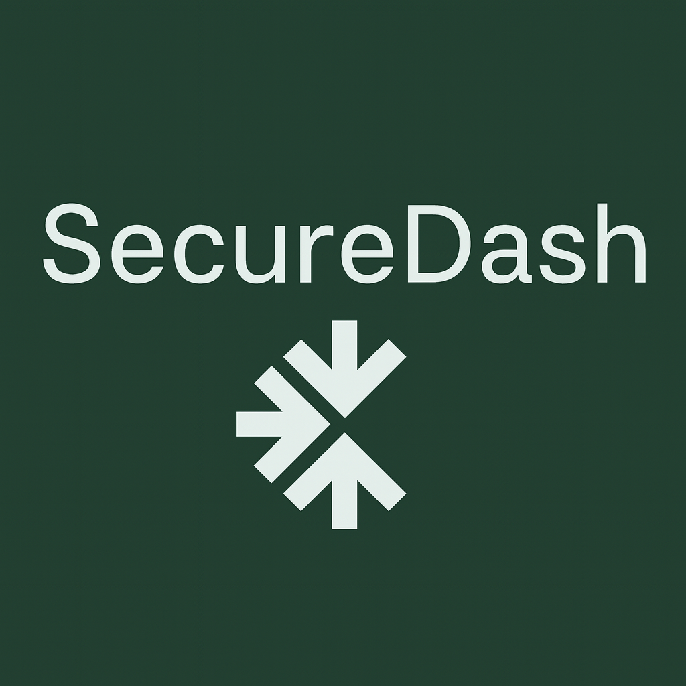

# Secure Dash - Dashboard de Fail2ban

Bienvenido a **Secure Dash**, el dashboard completo para monitorear y gestionar Fail2ban en tiempo real.

## :shield: ¿Qué es Secure Dash?

Secure Dash es una aplicación web moderna que proporciona una interfaz intuitiva para:

- **Monitoreo en tiempo real** de logs de Fail2ban
- **Gestión de IPs bloqueadas** con información detallada
- **Dashboard interactivo** con estadísticas y métricas
- **Administración de usuarios** con control de roles
- **Alertas automáticas** para actividades críticas

## :rocket: Características Principales

=== "Monitoreo en Tiempo Real"
    - Visualización de logs de Fail2ban en directo
    - Notificaciones push para nuevos eventos
    - Gráficos de tendencias y actividad

=== "Gestión de IPs"
    - Lista completa de IPs bloqueadas
    - Información de amenazas y geolocalización
    - Bloqueo manual de IPs
    - Historial de actividades

=== "Dashboard Interactivo"
    - Métricas en tiempo real
    - Gráficos de barras y líneas
    - Top 5 IPs más problemáticas
    - Estadísticas de rendimiento

=== "Administración"
    - Gestión de usuarios y roles
    - Control de permisos
    - Configuración del sistema
    - Exportación de datos

## :books: Comenzar

!!! tip "Inicio Rápido"
    Para comenzar a usar Secure Dash, revisa nuestra [Guía de Primeros Pasos](user-guide/getting-started.md).

### Navegación Rápida

| Sección | Descripción |
|---------|-------------|
| [**Autenticación**](user-guide/authentication.md) | Cómo iniciar sesión y registrarse |
| [**Dashboard**](user-guide/dashboard.md) | Visión general del panel principal |
| [**Logs**](user-guide/logs-management.md) | Gestión de logs de Fail2ban |
| [**IPs Bloqueadas**](user-guide/banned-ips.md) | Administración de IPs |
| [**Usuarios**](user-guide/users-management.md) | Control de usuarios del sistema |

## :computer: Requisitos del Sistema

- **Navegador web moderno** (Chrome, Firefox, Safari, Edge)
- **Conexión a internet** para funcionalidades en tiempo real
- **Resolución mínima** de 1024x768

!!! warning "Importante"
    Secure Dash requiere permisos de administrador para acceder a ciertas funcionalidades.