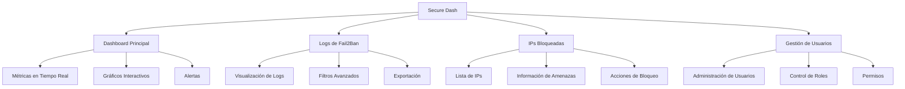

# Introducción a Secure Dash

## :wave: Bienvenido

Secure Dash es tu herramienta principal para monitorear y gestionar la seguridad de tu servidor a través de Fail2ban. Esta introducción te ayudará a familiarizarte con los conceptos básicos y la filosofía del sistema.

## :bulb: Conceptos Clave

### Fail2ban
Sistema de prevención de intrusiones que analiza archivos de log y bloquea IPs maliciosas automáticamente.

### Dashboard
Panel de control centralizado que muestra métricas, gráficos y estadísticas en tiempo real.

### Logs en Tiempo Real
Visualización instantánea de eventos de seguridad conforme ocurren en tu servidor.

### Gestión de IPs
Control completo sobre las direcciones IP bloqueadas, incluyendo bloqueo manual y desbloqueo.

## :shield: Filosofía de Seguridad

Secure Dash está diseñado con seguridad en mente:

!!! abstract "Principios de Seguridad"
    - **Visibilidad Total**: Ve todo lo que sucede en tu servidor
    - **Control Granular**: Gestiona cada aspecto de la seguridad
    - **Respuesta Rápida**: Actúa inmediatamente ante amenazas
    - **Análisis Profundo**: Comprende patrones de ataque

## :users: Tipos de Usuario

### Usuario Regular
- Visualizar dashboard y métricas
- Ver logs de Fail2ban
- Consultar IPs bloqueadas
- Exportar datos

### Administrador
- **Todas las funciones de usuario regular, más:**
- Gestionar otros usuarios
- Bloquear/desbloquear IPs manualmente
- Modificar configuraciones del sistema
- Acceder a funciones avanzadas

## :compass: Estructura de la Aplicación

## :art: Interfaz de Usuario

### Diseño Responsivo
La interfaz se adapta perfectamente a:
- **Escritorio** (1920x1080 y superiores)
- **Tablets** (768x1024)
- **Móviles** (320x568 y superiores)

## :zap: Funcionalidades en Tiempo Real

### WebSocket Connection
Secure Dash utiliza conexiones WebSocket para proporcionar:

- **Actualizaciones instantáneas** de logs
- **Notificaciones push** para nuevos eventos
- **Sincronización automática** de datos
- **Alertas en tiempo real** para amenazas críticas

!!! info "Conectividad"
    La aplicación mantiene una conexión constante con el servidor para garantizar información actualizada.

## :beginner: Próximos Pasos

1. **[Primeros Pasos](getting-started.md)** - Configura tu cuenta y accede al sistema
2. **[Autenticación](authentication.md)** - Aprende sobre el sistema de login
3. **[Navegación](navigation.md)** - Familiarízate con la interfaz
4. **[Dashboard](dashboard.md)** - Explora el panel principal

!!! tip "Consejo"
    Te recomendamos seguir los pasos en orden para obtener la mejor experiencia de aprendizaje.