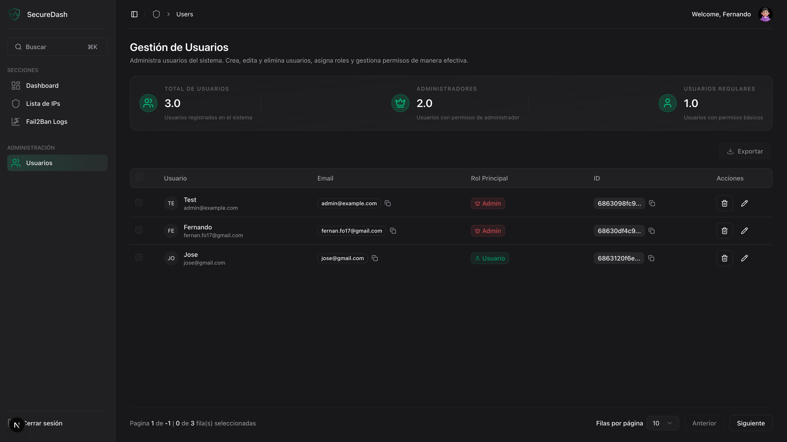
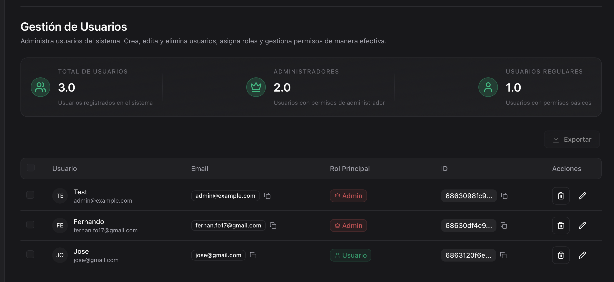
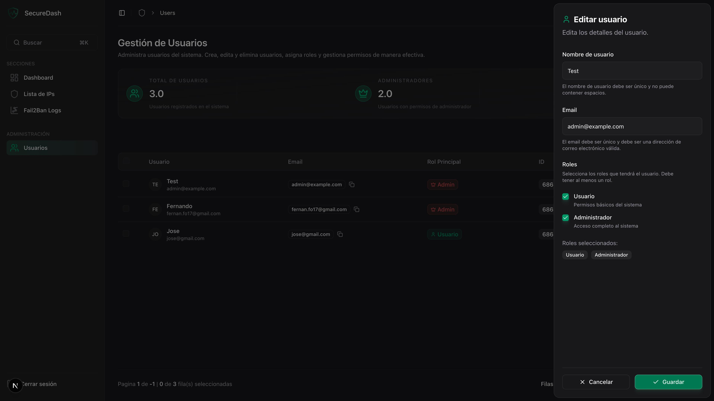

# Gestión de Usuarios

La sección de gestión de usuarios permite a los administradores controlar el acceso al sistema, asignar roles y gestionar permisos de manera granular.

## :busts_in_silhouette: Vista General

!!! warning "Acceso Restringido"
    Esta sección está disponible únicamente para usuarios con rol de **Administrador**.

### Pantalla Principal

La gestión de usuarios incluye:

1. **Estadísticas de Usuarios** - Métricas del sistema de acceso
2. **Herramientas de Administración** - Creación y gestión de cuentas
3. **Tabla de Usuarios** - Lista completa con información de acceso
4. **Panel de Edición** - Modificación de roles y permisos

## :bar_chart: Estadísticas del Sistema

### Métricas de Usuarios

#### Indicadores Principales

| Métrica | Descripción | Interpretación |
|---------|-------------|----------------|
| **Total Usuarios** | Cuentas totales en el sistema | Crecimiento de la plataforma |
| **Usuarios Administradores** | Cuentas con permisos completos | Control de acceso privilegiado |
| **Usuarios Regulares** | Cuentas con permisos básicos | Base de usuarios estándar |
| **Usuarios Activos (30d)** | Actividad reciente | Engagement de la plataforma |

## :hammer_and_wrench: Gestión de Cuentas

### Roles del Sistema

#### Estructura de Permisos

=== "Usuario Regular (USER)"
    **Permisos Incluidos:**
    - ✅ Ver dashboard y métricas
    - ✅ Consultar logs de Fail2ban
    - ✅ Ver lista de IPs bloqueadas
    - ✅ Exportar datos (limitado)
    - ❌ Bloquear/desbloquear IPs
    - ❌ Gestionar otros usuarios
    - ❌ Configurar sistema

=== "Administrador (ADMIN)"
    **Permisos Incluidos:**
    - ✅ **Todos los permisos de Usuario Regular**
    - ✅ Bloquear/desbloquear IPs manualmente
    - ✅ Gestionar usuarios del sistema
    - ✅ Asignar y modificar roles
    - ✅ Configurar políticas de seguridad
    - ✅ Acceder a logs de auditoría
    - ✅ Exportación completa de datos

### Creación de Usuarios

#### Proceso Automático
- **Registro libre** para usuarios regulares
- **Permisos básicos** asignados automáticamente
- **Elevación manual** a administrador

#### Creación Manual (Admins)
1. **Acceso directo** desde panel de administración
2. **Asignación inmediata** de roles
3. **Configuración avanzada** de permisos
4. **Notificación automática** al nuevo usuario

## Tabla de Usuarios

### Estructura de Datos

#### Columnas Principales

| Columna | Descripción | Funcionalidad |
|---------|-------------|---------------|
| **Username** | Nombre de usuario único | Identificador principal |
| **Email** | Dirección de correo | Contacto y autenticación |
| **Roles** | Permisos asignados | Badges con códigos de color |
| **Status** | Estado de la cuenta | Activo/Inactivo |

### Badges de Roles

#### Visualización de Permisos

**Usuario Regular:**
- **Badge verde** con texto "Usuario"
- **Icono**: Usuario simple
- **Tooltip**: "Permisos básicos del sistema"

**Administrador:**
- **Badge rojo** con texto "Administrador"
- **Icono**: Escudo con corona
- **Tooltip**: "Acceso completo al sistema"

## :pencil2: Edición de Usuarios

### Panel de Edición Lateral

#### Información Editable

**Datos Básicos:**
- **Nombre de usuario**: Único en el sistema
- **Email**: Verificación automática de formato

**Gestión de Roles:**
- **Selector múltiple** de roles disponibles
- **Validación**: Al menos un rol requerido
- **Confirmación**: Para cambios de administrador

#### Validaciones del Sistema

=== "Nombre de Usuario"
    - **Longitud**: 3-20 caracteres
    - **Caracteres permitidos**: Letras, números, guiones, guiones bajos
    - **Unicidad**: Verificación en tiempo real

=== "Email"
    - **Formato válido**: Validación RFC completa
    - **Unicidad**: Un email por cuenta
    - **Verificación**: Opcional para admins

=== "Roles"
    - **Mínimo un rol**: Usuario no puede quedar sin permisos
    - **Confirmación admin**: Cambios requieren confirmación
    - **Auto-asignación**: Usuario regular por defecto

### Proceso de Edición

#### Flujo de Modificación

1. **Seleccionar usuario** en la tabla
2. **Abrir panel** de edición lateral
3. **Modificar campos** necesarios
4. **Validación automática** en tiempo real
5. **Guardar cambios** con confirmación
6. **Notificación** de éxito/error

#### Confirmaciones de Seguridad

**Cambios Críticos que Requieren Confirmación:**
- **Remoción de rol administrador** del propio usuario
- **Desactivación** de cuenta administrador
- **Eliminación** de usuarios con actividad reciente
- **Cambios masivos** de permisos

#### Limitaciones de Seguridad

**Restricciones de Protección:**
- **No puede eliminarse** a sí mismo
- **Máximo 50 usuarios** por operación en lote
- **Confirmación obligatoria** para cambios críticos
- **Log de auditoría** completo de cambios

### Gestión de Permisos Avanzada

#### Políticas de Acceso

**Horarios de Acceso:**
- **24/7**: Sin restricciones (por defecto)
- **Horario laboral**: 8 AM - 6 PM días laborales
- **Personalizado**: Definido por administrador

**Restricciones de IP:**
- **Sin restricción**: Acceso desde cualquier IP
- **IP corporativa**: Solo desde redes autorizadas
- **Lista blanca**: IPs específicas permitidas

**Límites de Sesión:**
- **Sesiones concurrentes**: 1-5 sesiones simultáneas
- **Duración máxima**: 1-24 horas
- **Inactividad**: 15 minutos - 8 horas

## :eye: Panel de Detalles de Usuario

### Acciones Administrativas

#### Herramientas de Gestión

**Gestión de Cuenta:**
- **Eliminar usuario**: Eliminación completa

### Políticas de Seguridad

#### Mejores Prácticas Implementadas

!!! success "Controles de Seguridad"
    - **Principio de menor privilegio**: Permisos mínimos necesarios
    - **Separación de funciones**: Roles claramente definidos
    - **Revisión periódica**: Auditoría regular de permisos
    - **Trazabilidad completa**: Log de todas las acciones

#### Alertas de Seguridad

**Eventos que Generan Alertas:**
- **Creación de administrador**: Notificación inmediata
- **Múltiples fallos de login**: Posible ataque
- **Acceso desde IP nueva**: Verificación adicional
- **Cambios fuera de horario**: Actividad sospechosa

### Principios de Seguridad

!!! warning "Consideraciones Importantes"
    - **Nunca compartas** credenciales de administrador
    - **Revoca acceso** inmediatamente al terminar empleo
    - **Usa cuentas temporales** para contratistas
    - **Documenta justificaciones** para roles administrativos

### Mantenimiento Regular

!!! info "Rutinas Recomendadas"
    - **Limpieza mensual** de cuentas inactivas
    - **Revisión trimestral** de roles asignados
    - **Auditoría semestral** de permisos
    - **Backup anual** de configuraciones

## :warning: Solución de Problemas

### Problemas Comunes

=== "No puedo editar usuario"
    **Síntomas**: Botones deshabilitados o errores

    **Posibles causas**:
    - Permisos insuficientes
    - Usuario editando su propia cuenta
    - Sesión expirada

    **Soluciones**:
    - Verifica rol de administrador
    - Usa otra cuenta admin para editar
    - Refresca sesión

=== "Error al cambiar roles"
    **Síntomas**: Cambios no se guardan

    **Posibles causas**:
    - Intentando remover último admin
    - Validación de formulario falla
    - Problema de conectividad

    **Soluciones**:
    - Mantén al menos un administrador
    - Verifica campos requeridos
    - Reintenta operación

=== "Usuario no puede acceder"
    **Síntomas**: Login falla para usuario creado

    **Posibles causas**:
    - Cuenta inactiva
    - Contraseña no establecida
    - Email no verificado

    **Soluciones**:
    - Activa la cuenta manualmente
    - Resetea contraseña
    - Verifica configuración de email

!!! danger "Situaciones Críticas"
    - **Único administrador**: Nunca elimines el último admin
    - **Bloqueo masivo**: Mantén acceso de emergencia
    - **Compromiso de cuenta**: Suspende inmediatamente
    - **Pérdida de acceso**: Contacta soporte del sistema